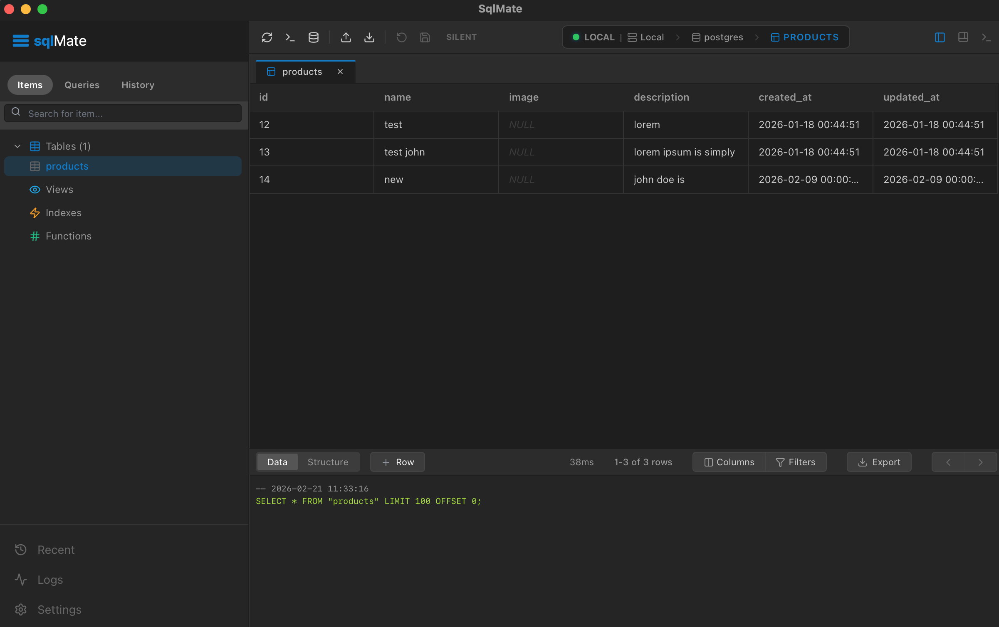
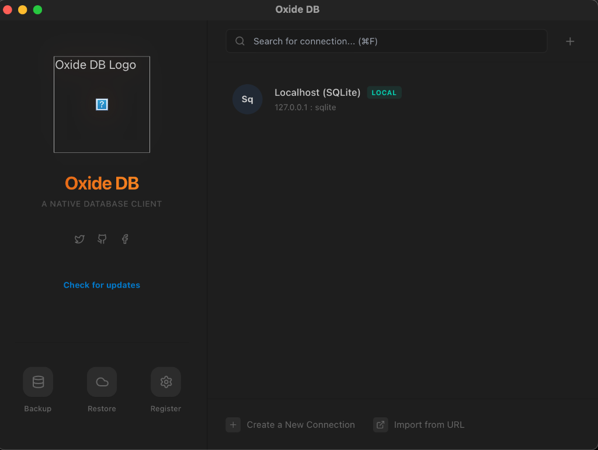
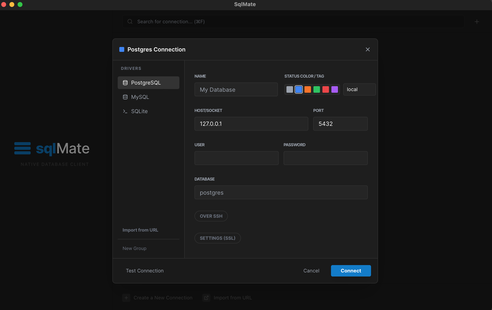

<p align="center">
  
</p>

## Screenshots

<p align="center">
  
  <br />
  <em>The modern, clean workspace in SqlMate</em>
</p>

<p align="center">
  
  
  <br />
  <em>Welcome screen and connection management</em>
</p>

> [!TIP]
> **Capturing High-Quality Screenshots**: To avoid blurriness, capture screenshots on a Retina display (MacBooks) using `Cmd + Shift + 4`, then `Space` to select the window. This saves a high-DPI image. The README is configured to display these at half-width for maximum sharpness.

## Features

- **Multi-Database Support**: Connect to PostgreSQL, MySQL, and SQLite.
- **Modern Sidebar Experience**:
  - **Items**: Explore your databases, schemas, and tables.
  - **Queries**: Manage your saved SQL scripts.
  - **History**: A persistent, searchable log of all executed queries, grouped by date.
- **Advanced Query History**:
  - **Automatic Tracking**: Every query executed (manually or via table browsing) is recorded.
  - **Date Grouping**: Queries are logically grouped by day with collapsible sections.
  - **Search & Filter**: Quickly find past queries using the integrated search.
  - **Replay**: Instant replay of any historical query into a new editor tab.
- **Persistence**: Your connection settings and query history are saved locally for a seamless experience across restarts.
- **Native Performance**: Leverages Rust for backend operations and Tauri for a smooth desktop experience.

## Getting Started

### Prerequisites

- [Node.js](https://nodejs.org/)
- [Rust](https://www.rust-lang.org/)
- [Tauri Dependencies](https://tauri.app/v1/guides/getting-started/prerequisites)

### Installation

1. Clone the repository:
   ```bash
   git clone https://github.com/Nitish27/sqlMate.git
   cd sqlMate
   ```

2. Install dependencies:
   ```bash
   npm install
   ```

3. Run in development mode:
   ```bash
   npm run tauri dev
   ```

## Tech Stack

- **Frontend**: React, TypeScript, Tailwind CSS, Monaco Editor, Lucide Icons.
- **Backend**: Rust (using `sqlx` for database interactions).
- **Framework**: [Tauri](https://tauri.app/).

## Recommended IDE Setup

- [VS Code](https://code.visualstudio.com/) + [Tauri](https://marketplace.visualstudio.com/items?itemName=tauri-apps.tauri-vscode) + [rust-analyzer](https://marketplace.visualstudio.com/items?itemName=rust-lang.rust-analyzer)
